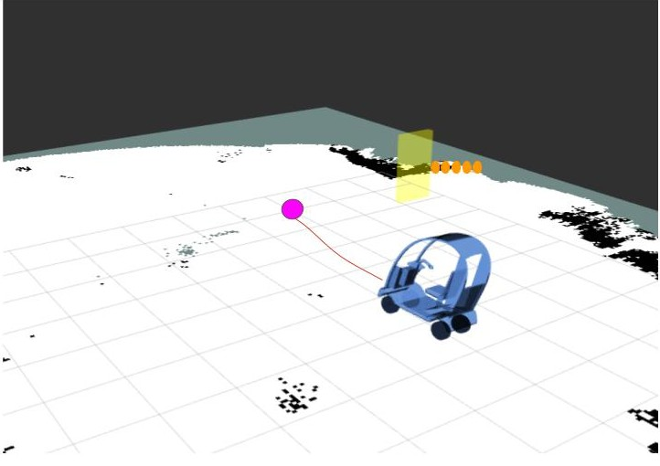

This repository explores the operations with Game Theory for decision making. 
I have been researching about different ways to integrate sequential games for decision making into robotics.

# Current Work

1. Currently the game theory experiments have been conducted using the existing `Nashpy` library with reference to previous work carrried in https://www.semanticscholar.org/paper/When-Should-the-Chicken-Cross-the-Road-Game-Theory-Fox-Camara/db03667574a7abfdbab1656ce803352bc57c874d 

2. The custom ros2 game theory package has been created for real-vehicle experimentation and demonstration:  `ros2_chicken_game`. This ros2 package is integrated with a bigger custom ros2 stack of the autonomous vehicle: OpenPodCar_2

* OpenPodCar_2: `https://github.com/Rak-r/OpenPodCar_V2.git`

3. The concept of Game theory integration is based on the strong fact that it provides probabilistic outcomes instead of pure outcomes which is importamt in Autonomous driving research with interaction in real world. 

4. The experiments have been performed with the Open source Hardware & Software platform named `OpenPodCar_2` which is the upgraded version of predecessor.

The research focus on the integration of Pedestrian psychological behaviour into robot/autonomous vehicle control algorithms by providing the decison making ability which consist of the behavioural information in shared space. The current work is one of the (early/very few) research exprimentation and study on real physical vehicle. The image below shows the real-time experiment comducted in ros2 enviroment.

  

# Future work

## Integrating ROS2 and Gambit

Gambit is more extensive library to conduct more accurate game theory related work. Extending the existing work to Gambut based system is one of the future tasks at the moment.

I provide some insights of using Gambit and ROS2 at veyr simple level along with some game theory concepts.

1. The script `Test_Game_Theory_ROS2.py` includes a simple game similar to `Prisonor's Dilemma` created using gambit.
2. To test the gambit connection with ROS2 Twist commands, a simple payoff outputs are assigned only to `linear.x` field.
3. To test the working with `Gazebo  Garden / ignition Fortress`, we can create a `ros_gz_bridge` with the following command.
   * `ign gazebo ackermann_steering.sdf` or `gz sim ackermann_steering.sdf`
   * `ros2 run ros_gz_bridge parameter_bridge /model/vehicle_blue/cmd_vel@geometry_msgs/msg/Twist]gz.msgs.Twist`.
   * In the new terminal : `python3 Test_Game_theory_ROS2.py`

4. In the terminal, check `ros2 topic list` to check the published topic.
5. We can visualise the robot moving with the output of the game's payoff.

##### Note: This script shows an initial insights to integrate game outputs with ROS2 and testing in simulation. In future more in-depth exploration will be provided.

